# Ask Anixi: An AI Clinical Copilot for the Doctor Portal

**A plain-language strategy document — for clinicians, product, engineering, and leadership**

---

## 1. Executive Summary

Anixi's doctor portal already captures everything a clinician needs during a typical day: patients, appointments, vitals, mood logs, medication adherence, consult notes, prescriptions, and invoices. Today, a doctor has to manually read through all of that, in every screen, every time.

**The opportunity:** wrap an AI layer — "Ask Anixi" — around the data we already collect, so it does the reading, summarizing, drafting, and flagging _for_ the doctor, and the doctor simply reviews and approves. This is not a chatbot bolted onto the side of the app. It is a copilot that shows up exactly where the doctor is already working, using the information already in front of it.

**In one sentence:** Anixi becomes the first telehealth platform in South Africa where the software actively works _for_ the doctor between and during consultations — not just a system the doctor has to work _with_.

**Why this matters for the business:** it is a defensible differentiator (competitors have booking + video; almost none have a working clinical copilot), it directly reduces doctor admin time (the #1 complaint in every physician-burnout survey), and it creates a natural upsell tier ("Anixi Copilot") once the free/base product has proven itself.

---

## 2. The Problem Today

A doctor using the portal currently has to do all of the following _manually_, for every patient, every day:

| Task                                                                      | Where it happens today                                          | Time cost               |
| ------------------------------------------------------------------------- | --------------------------------------------------------------- | ----------------------- |
| Remember what happened at the last visit                                  | Nowhere — doctor has to click into old records                  | 2–5 min per patient     |
| Notice a patient's health is trending the wrong way                       | Nowhere — doctor has to open vitals/adherence charts one by one | Often missed entirely   |
| Write up notes, prescriptions, and letters after a consult                | Typed from scratch on `PostConsultPage`                         | 5–10 min per consult    |
| Look up the correct ICD-10 diagnosis code and NAPPI drug code for billing | Manual lookup / memory                                          | 2–3 min per invoice     |
| Decide which of 50 patient messages needs a reply _right now_             | Read every message in order                                     | Ongoing distraction     |
| Decide which patients need a check-in this week                           | Scan the whole patient list                                     | Rarely done proactively |

None of this is a technology gap — the data already exists in Firestore. It's a **"someone has to read it"** gap. That's exactly the gap AI closes.

---

## 3. The Vision: "Ask Anixi"

A persistent, context-aware assistant that lives inside the doctor portal — not a separate app, not a separate login. Wherever the doctor is looking, "Ask Anixi" already knows:

- Who the patient is
- What their history, medications, allergies, and chronic conditions are
- What their vitals, mood, and adherence trends look like
- What was discussed and prescribed last time
- What's outstanding (unpaid invoices, unread messages, unconfirmed appointments)

And it uses that knowledge to **draft things a doctor would otherwise have to write themselves** — always presented as a suggestion the doctor reviews, edits, and approves. It never silently sends a prescription, message, or invoice on its own.

> **Golden rule:** AI drafts. The doctor decides. Every single time, for anything clinical or financial.

---

## 4. Value It Creates — By Audience

### For doctors

- **Time back.** Less time spent reading charts, writing notes, and hunting for billing codes means more time with patients (or more patients seen per day).
- **Fewer things fall through the cracks.** A patient's declining adherence or worsening vitals gets flagged automatically instead of relying on the doctor noticing during a routine glance.
- **Less admin burnout.** Coding, invoicing, and note-writing are consistently ranked as doctors' most disliked tasks — this is where AI assistance is most welcomed, not resisted.

### For patients

- **Faster responses.** Draft replies mean doctors can triage and respond to messages faster.
- **More consistent follow-up.** Patients who are quietly struggling (missed meds, worsening symptoms) are more likely to be proactively contacted rather than waiting for their next scheduled visit.
- **More accurate paperwork.** AI-assisted coding reduces invoice/medical-aid claim errors.

### For the practice / business side

- **Billing accuracy.** Correct ICD-10 and NAPPI codes reduce claim rejections from medical schemes.
- **Retention driver.** A copilot that saves doctors real time every day is a strong reason to stay on Anixi instead of switching to a competitor.
- **Monetization path.** This is a natural premium tier: base platform is booking + records; "Anixi Copilot" is a paid upgrade for practices that want it.

### For Anixi as a company

- **Differentiation.** Most competitors in this space have digitized paperwork. Very few have made the software actively think alongside the doctor.
- **Data moat.** The more consults that happen on Anixi, the smarter and more useful the copilot becomes for that doctor and practice — a compounding advantage competitors can't copy overnight.

---

## 5. Where It Shows Up — Concrete, Screen-by-Screen

This isn't abstract. Here is exactly how it plugs into the doctor portal that exists today.

### 5.1 Dashboard — "Your morning briefing"

**Today:** The dashboard shows a raw count of "stable" vs. "inactive" patients based on a simple adherence-percentage cutoff.

**With Ask Anixi:** The dashboard opens with a short, human-readable briefing:

> _"3 patients need your attention today: Adama Jarju's blood pressure has trended up 15% over two weeks and medication adherence dropped to 40%. Two patients have appointments today with no notes from their last visit reviewed."_

Instead of a doctor having to go looking for problems, problems come to the doctor.

### 5.2 Appointment details — "Review this visit before you begin"

**Today:** The appointment details page literally invites the doctor to "review this visit before you begin" — but shows only the date, time, and type. There's nothing to actually review.

**With Ask Anixi:** A short AI-generated pre-visit summary appears automatically: last visit's diagnosis and plan, active chronic conditions and allergies, recent vitals/mood/adherence trend, and any unpaid invoices — everything a doctor would want to know in the 20 seconds before walking into a consult.

### 5.3 During the video consult — "Ambient scribe"

**Today:** After a teleconsult, the doctor manually types up notes, a prescription, and possibly a letter from memory.

**With Ask Anixi:** While the video consult happens, the conversation is transcribed and the copilot drafts a structured note (Subjective / Objective / Assessment / Plan), a prescription with suggested dosage, and a doctor's letter if needed — all pre-filled and waiting for the doctor to review, correct, and sign off. This is the single highest-value feature: it is consistently the most-loved AI feature among doctors everywhere it has been deployed, because it gives back the time spent on documentation without changing how the doctor actually practices medicine.

### 5.4 Billing and coding — "Suggested codes"

**Today:** The doctor manually looks up and types the correct ICD-10 diagnosis code and NAPPI medication code for every prescription and invoice line.

**With Ask Anixi:** The doctor types the diagnosis or medication in plain language ("high blood pressure," "Panado 500mg") and the copilot suggests the matching ICD-10 and NAPPI codes, ranked by likelihood, ready to accept with one click. This directly reduces medical-aid claim rejections, which is a real, quantifiable cost to practices today.

### 5.5 Patient monitoring — "Flag, don't force"

**Today:** A doctor has to open a patient's adherence log, vitals history, and mood log separately, and notice a downward trend themselves.

**With Ask Anixi:** Trends are monitored automatically in the background, and the doctor only sees a flag when something is actually worth their attention — turning "doctor must remember to check" into "system tells the doctor when it matters."

### 5.6 Messages — "What matters first"

**Today:** Messages are read in whatever order they arrive.

**With Ask Anixi:** Messages are triaged by urgency (a message mentioning chest pain surfaces above a routine prescription-refill request) and draft replies are suggested for common requests, so a doctor can approve-and-send in seconds instead of typing from scratch.

### 5.7 Search — "Ask, don't click through"

**Today:** The search bar matches names and appointments literally.

**With Ask Anixi:** A doctor can type something like _"diabetic patients who missed their meds this week"_ and get an actual filtered list, instead of manually filtering the patient list themselves.

---

## 6. How It Works (Plain-Language Architecture)

```mermaid
flowchart LR
    subgraph DoctorPortal["Doctor Portal (what the doctor sees)"]
        A[Dashboard briefing]
        B[Pre-visit summary]
        C[Ambient scribe during consult]
        D[Suggested billing codes]
        E[Patient risk flags]
        F[Message draft replies]
    end

    subgraph Brain["AI Gateway (server-side, not in the app itself)"]
        G[Reads existing patient data]
        H[Calls the AI model]
        I[Turns the AI's answer into a safe, reviewable draft]
    end

    subgraph Data["Existing Anixi Data (already collected today)"]
        J[(Patients, vitals, mood, adherence)]
        K[(Appointments & consult notes)]
        L[(Prescriptions & invoices)]
        M[(Messages)]
    end

    DoctorPortal <--> Brain
    Brain <--> Data
```

**In plain terms:**

1. Nothing changes about how or where Anixi stores patient data. The AI layer _reads_ the data that already exists — it doesn't require a new database.
2. All AI requests go through a secure server-side gateway, never directly from the doctor's browser. This keeps patient data — and the AI provider's access to it — controlled and auditable, the same way the rest of the app already protects data with permissions and sign-in.
3. The AI is only ever allowed to _propose_ an action (a draft note, a suggested code, a flagged patient). It is never allowed to send a message, submit a prescription, or issue an invoice on its own. A doctor's review-and-approve step is a hard requirement, not a setting that can be turned off.
4. Every suggestion the AI makes, and what the doctor did with it (accepted, edited, or ignored), is logged — both to prove compliance and to make the AI better over time.

---

## 7. Trust, Safety, and Compliance

Because this is a healthcare product operating under South African regulation, trust isn't optional — it's the product.

- **Human-in-the-loop, always.** Nothing clinical or financial is ever sent, prescribed, or billed without explicit doctor approval. The AI's role is strictly "propose," never "execute."
- **POPIA compliance.** Any use of patient data by an AI provider must be covered by a proper data processing agreement, consistent with the privacy notice already published in the doctor portal.
- **HPCSA defensibility.** Every AI suggestion and every doctor decision on it is logged, so a doctor can always show exactly what was suggested and what they actually did — protecting the doctor, not just the platform.
- **Explainability.** Every AI suggestion shows _why_ — which vitals reading, which past note, which message triggered it — so a doctor never has to trust a black box.
- **Reversibility.** Because everything is a draft until approved, there is no scenario where the AI causes irreversible harm through a mistake — the worst case is a suggestion the doctor simply doesn't use.

---

## 8. Rollout Plan

The rollout is intentionally staged from "safe and immediately useful" to "deeply embedded," so value is delivered continuously rather than waiting for one big launch.

| Phase                           | What ships                                                                                                                                                                                      | Why this order                                                                                                                    | Relative effort |
| ------------------------------- | ----------------------------------------------------------------------------------------------------------------------------------------------------------------------------------------------- | --------------------------------------------------------------------------------------------------------------------------------- | --------------- |
| **Phase 1 — Quick Wins**        | AI-suggested ICD-10/NAPPI billing codes; pre-visit patient summaries; draft replies to patient messages                                                                                         | Uses data that already exists in text form; no new infrastructure; immediately reduces daily admin time; lowest risk              | Low             |
| **Phase 2 — Deep Integration**  | Ambient scribe (auto-drafted consult notes and prescriptions from the video call); smarter patient risk-flagging to replace the current basic adherence cutoff; natural-language patient search | Requires audio transcription pipeline and trend-detection logic; highest doctor-facing value                                      | Medium          |
| **Phase 3 — Proactive Copilot** | Automated daily briefings across the whole patient panel; AI-assisted follow-up scheduling; personalized patient education drafts per condition                                                 | Builds on the trust and data collected in Phases 1–2; moves from "answers when asked" to "acts proactively, always with approval" | Medium–High     |

Each phase stands on its own and delivers value independently — there's no requirement to build Phase 3 to benefit from Phase 1.

---

## 9. How We'll Know It's Working

| Metric                                                                  | What it tells us                          |
| ----------------------------------------------------------------------- | ----------------------------------------- |
| Minutes spent per consult on note-writing/coding (before vs. after)     | Direct admin time saved                   |
| % of AI-suggested codes accepted without edits                          | Quality/trust in suggestions              |
| % of AI-drafted notes/messages accepted vs. rewritten from scratch      | Usefulness of drafts                      |
| Claim rejection rate from medical schemes                               | Real financial impact of better coding    |
| Number of proactively-flagged patients who were then actually contacted | Whether flags translate into earlier care |
| Doctor-reported time saved / satisfaction (survey)                      | Qualitative validation                    |

---

## 10. Risks and How We Manage Them

| Risk                                                | Mitigation                                                                                                |
| --------------------------------------------------- | --------------------------------------------------------------------------------------------------------- |
| AI suggests something clinically wrong              | Doctor approval is mandatory for every clinical action; nothing is ever auto-submitted                    |
| Patient data handled by a third-party AI provider   | Server-side gateway only; formal data processing agreement; no PHI in the client app                      |
| Doctors don't trust or don't use the suggestions    | Always show the "why" behind a suggestion; make every suggestion trivially easy to ignore or edit         |
| Over-reliance leads to skill atrophy or complacency | Position and design the tool explicitly as a second pair of eyes, not a replacement for clinical judgment |
| Regulatory scrutiny (POPIA/HPCSA)                   | Full audit trail of every suggestion and doctor decision, from day one                                    |

---

## 11. The Bottom Line

Anixi already asks doctors to trust it with patient records, scheduling, and billing. The next step is simple to state and hard for competitors to copy quickly: **make the software start doing some of the doctor's thinking for them — safely, transparently, and only with their sign-off.**

That's the difference between a portal a doctor has to operate, and a copilot that works _for_ them.

---

## Appendix: Technical Notes (for engineering)

- **AI Gateway:** New Firebase Cloud Function(s), never called directly from the client bundle. Enforces the same `usePermissions`/`can()` checks already used throughout the doctor portal.
- **Tool-calling, not free-form chat:** The model is given a fixed set of tools mapped to existing services — `getPatientById`, `getAdherenceStats`, `savePrescriptionDraft`, `createInvoiceRecord`, `sendPatientNotification`, etc. It calls tools to gather context; any tool that writes clinical/financial data returns a draft object requiring explicit doctor confirmation before persisting.
- **Grounding / RAG:** Prior consult notes (`PostConsultAction`), uploaded documents (`AppointmentDocument`), and patient profile fields are indexed per doctor/practice so answers are grounded in real records rather than generated from general knowledge.
- **Ambient scribe pipeline:** LiveKit (already used for teleconsults) → audio egress → speech-to-text → structuring model call → draft `PostConsultAction` tagged with `source: 'ai'` metadata, surfaced in the existing `PostConsultPage` review flow.
- **Audit log:** New Firestore collection recording every AI suggestion, its source data, and the doctor's accept/edit/reject action.
- **Quick-win implementation note:** The ICD-10/NAPPI suggestion feature can be added directly next to the existing `icd10Code`/`nappiCode` fields in `PostConsultPage.tsx` and `InvoiceCreate.tsx`, reusing the SA reference data already built in `src/lib/southAfrica.ts` (`COMMON_ICD10_CODES`, `isValidNappiCode`).
